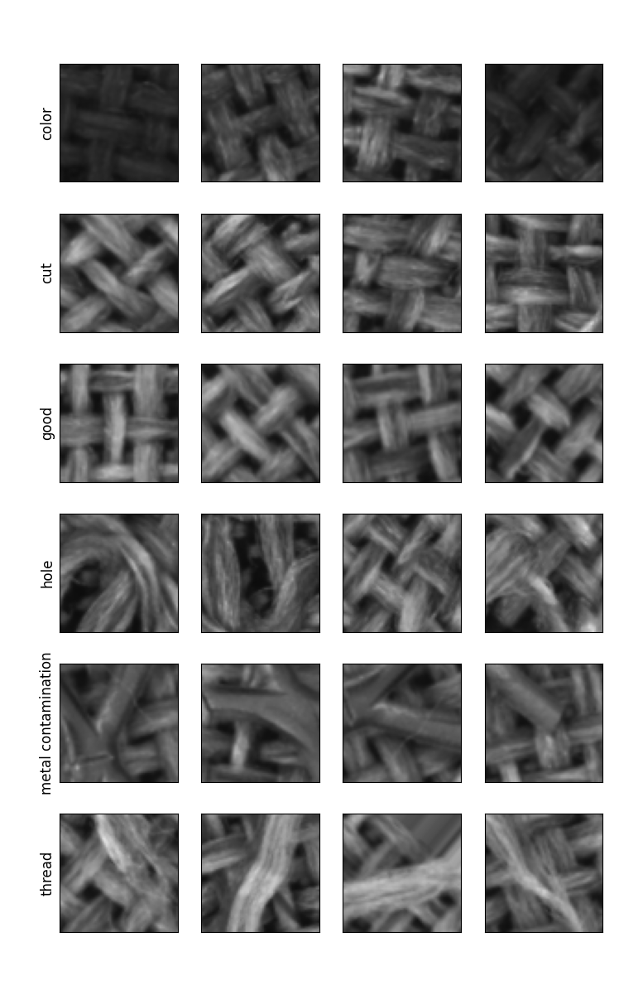

<p align="center">
  <a href="https://www.perceptilabs.com">
  
  </a>
</p>

# Textile-Classification

This example PerceptiLabs model, shows how a [residual neural network](https://en.wikipedia.org/wiki/Residual_neural_network) (ResNet) can be trained to detect anomalies in textile manufacturing, by learning to classify close-up images of textile fibers. 

# Model Overview

The model is based on the skip connection pattern from ResNet. Like other vision backbones (VGG, ResNet, EfficientNet), it is designed for image classification. The output of the model is a probability distribution over 6 distinct classes.

## Dataset

The dataset is hosted publicly on Google Drive and can be downloaded [here (1.2 GB)](https://drive.google.com/drive/folders/1i-k71RMxa0LjNJqAjh-cclN6RA-WeBmv?usp=sharing).

The dataset consists of two files:

* `X.npy` is a [NumPy](https://numpy.org/) array of shape [72000, 64, 64, 1], corresponding to 72,000 distinct 64x64 monochrome images.
* `Y.npy` is a NumPy array of shape [72000], which consists of the corresponding integer labels for each defect type.


The dataset is derived from the [Textile Defect Detection dataset on Kaggle](https://www.kaggle.com/belkhirnacim/textiledefectdetection/version/2). We pre-processed the data into two NumPy arrays which can be immediately used for training in PerceptiLabs via Data components.


The **Textile Defect Detection** dataset has images of textiles with their corresponding labels based of different kinds of defects that may take place in an industrial setting. A randomly selected set of images from each class looks like the following:




# Installation

**Note**: you must be running PerceptiLabs 0.10.0 or higher to load this model.

Follow the steps below to load the sample model in PerceptiLabs:

1. Download the data files (**X.npy** and **Y.npy**) from [here](https://drive.google.com/drive/folders/1i-k71RMxa0LjNJqAjh-cclN6RA-WeBmv?usp=sharing).
2. Clone or download the sample model from GitHub.
2. On the **ModelHub** screen, import the sample model into PerceptiLabs. When prompted for the model's directory, navigate to and select the location of the **model.json** file.
3. Open the topmost Data component in the model, navigate to its code tab and update the call to ```np.load()``` passing in the absolute path of the **X.npy** data file that you downloaded in Step 1. For example:
```python
...
matrix_DataData_Data_1_0 = np.load("c:/Textile-Classification-master/X.npy", mmap_mode='r+').astype(np.float32)
...
```
4. Save the code changes for that Data component.
5. Open the bottom most Data component, navigate through its menus until you get to the **Choose Files** button.
6. Click **Choose Files**, navigate to the **Y.npy** data file that you downloaded in Step 1, and click **Confirm**.


# Community

Got questions, feedback, or want to join a community of machine learning practitioners working with exciting tools and projects? Check out our [Community page](https://www.perceptilabs.com/community)!
